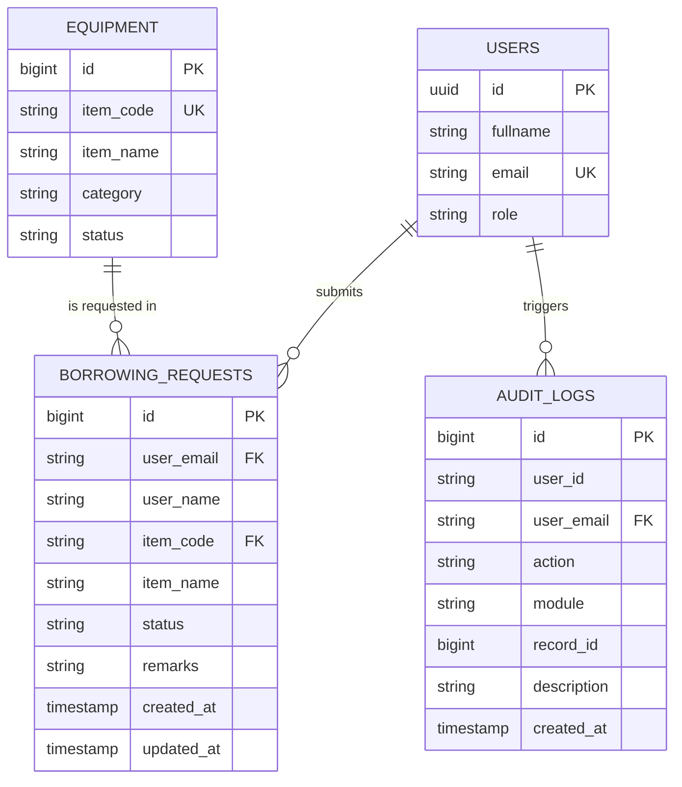
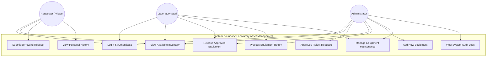
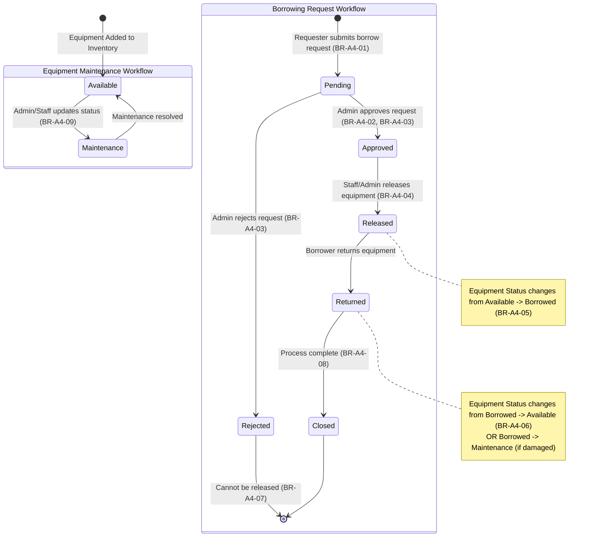

# Laboratory Asset and Service Management System
## System Documentation & Architecture Overview

---

### 1. Updated Entity-Relationship Diagram (ERD)

---

### 2. Use Case Diagram

---

### 3. Role-Permission Matrix

| Functional Feature / Operation | Requester / Viewer | Laboratory Staff | Administrator |
| :--- | :---: | :---: | :---: |
| **Authenticate & Login** | Allowed | Allowed | Allowed |
| **View Equipment Inventory** | Allowed | Allowed | Allowed |
| **Submit Borrowing Request** | Allowed | Allowed | Allowed |
| **View Own Borrowing History** | Allowed | Allowed | Allowed |
| **Approve / Reject Borrow Requests** | Denied | Denied | Allowed |
| **Approve Own Borrow Request** | Denied | Denied | Denied (Blocked by BR-A4-02) |
| **Release Equipment to Borrower** | Denied | Allowed | Allowed |
| **Process Equipment Returns** | Denied | Allowed | Allowed |
| **Add New Inventory Items** | Denied | Denied | Allowed |
| **Set Equipment Maintenance Status** | Denied | Allowed | Allowed |
| **View System Audit Trail** | Denied | Denied | Allowed |

---

### 4. Workflow Diagram (Transaction & State Progression)

---

### 5. Business Rules Specification

| Rule ID | Rule Name | Enforced Behavior / Condition |
| :--- | :--- | :--- |
| **BR-A4-01** | Equipment Availability | Borrow requests can only be placed on equipment currently marked as `Available`. |
| **BR-A4-02** | Self-Approval Restriction | Administrators and Staff cannot approve their own submitted borrowing requests. |
| **BR-A4-03** | Approval Authority | Only users with the `Administrator` role are authorized to Approve or Reject pending borrowing requests. |
| **BR-A4-04** | Release Pre-requisite | Only requests in `Approved` status can be transitioned to `Released`. |
| **BR-A4-05** | Equipment State on Release | Releasing equipment automatically sets the corresponding equipment's inventory status to `Borrowed`. |
| **BR-A4-06** | Equipment State on Return | Returning equipment transitions the request to `Returned` and resets equipment status to `Available` (or `Maintenance` if flagged damaged). |
| **BR-A4-07** | Rejected Request Lockout | Requests in `Rejected` status are locked and can never be released. |
| **BR-A4-08** | Single Return Enforcement | A returned transaction (`Returned` / `Closed`) cannot be processed for return a second time. |
| **BR-A4-09** | Maintenance Lockout | Equipment with `Maintenance` status is excluded from the available request choices. |
| **BR-A4-10** | Audit Log Accountability | All critical system events (Request, Approval, Rejection, Release, Return, Asset Creation, Status Changes) must automatically generate an immutable entry in `audit_logs`. |
